# Animation Data Flow Issue: Visual Analysis

**Date:** October 12, 2025

## The Problem Visualized

```mermaid
flowchart TB
    %% Three-Pass Architecture
    PASS1["🔵 PASS 1: Reference IK<br/>bundleRef<br/>Free base motion"]
    PASS1_OUT["📤 Pass 1 Output<br/>referenceInitialIk.eePositions<br/>(IDEAL - no chassis constraints)"]
    
    PASS2["🔵 PASS 2: Chassis Simulation<br/>simulateChassisExecution<br/>Pure pursuit + dynamics"]
    PASS2_OUT["📤 Pass 2 Output<br/>execBaseStates<br/>(REALISTIC base with constraints)"]
    
    PASS3["🔵 PASS 3: Final IK<br/>bundleFinal<br/>Base locked to execBaseStates"]
    PASS3_OUT["📤 Pass 3 Output<br/>log.qTraj<br/>stageC.eePositions<br/>(ACTUAL simulation result)"]
    
    %% Animation Preparation
    PREP["📋 animateStagedWithHelper.m<br/>Data Preparation"]
    
    WRONG_PRIORITY["❌ CURRENT (WRONG)<br/>Priority 1: referenceInitialIk.eePositions<br/>Priority 2: targetPositions<br/>Priority 3: stageC.eePositions"]
    
    RIGHT_PRIORITY["✅ SHOULD BE<br/>Priority 1: stageC.eePositions<br/>Priority 2: targetPositions<br/>Priority 3: referenceInitialIk.eePositions"]
    
    %% Animation Rendering
    ANIM["🎬 animate_whole_body.m<br/>Rendering"]
    
    GREEN_EE["🟢 Green Path (Actual EE)<br/>FK on log.qTraj<br/>Shows ACTUAL motion<br/>✅ CORRECT"]
    
    RED_DOT["🔴 Red Dot (Stage C Ref)<br/>Currently: referenceInitialIk.eePositions<br/>Shows IDEAL (Pass 1)<br/>❌ WRONG - large deviation"]
    
    MAGENTA["🟣 Magenta Path<br/>Currently: referenceInitialIk.eePositions<br/>Shows IDEAL (Pass 1)<br/>❌ WRONG - large deviation"]
    
    WHITE["⚪ White Path (Desired)<br/>JSON waypoints<br/>Shows GOAL<br/>✅ CORRECT"]
    
    %% Visual Output
    OUTPUT["📺 Visual Output<br/>User sees discrepancy"]
    
    %% Connections
    PASS1 --> PASS1_OUT
    PASS1_OUT --> PASS2
    PASS2 --> PASS2_OUT
    PASS2_OUT --> PASS3
    PASS3 --> PASS3_OUT
    
    PASS1_OUT -.->|Currently used| PREP
    PASS3_OUT -.->|Should be used| PREP
    
    PREP --> WRONG_PRIORITY
    WRONG_PRIORITY -->|Sends Pass 1 data| ANIM
    
    PREP -.-> RIGHT_PRIORITY
    RIGHT_PRIORITY -.->|Should send Pass 3 data| ANIM
    
    PASS3_OUT -->|Used correctly| GREEN_EE
    WRONG_PRIORITY --> RED_DOT
    WRONG_PRIORITY --> MAGENTA
    WHITE --> ANIM
    
    GREEN_EE --> OUTPUT
    RED_DOT --> OUTPUT
    MAGENTA --> OUTPUT
    WHITE --> OUTPUT
    
    OUTPUT -->|"Why is red dot<br/>far from green line?"| USER_CONFUSION["❓ User Confusion"]
    
    %% Styling
    classDef pass1 fill:#bbdefb,stroke:#1976d2,stroke-width:2px
    classDef pass2 fill:#c5e1a5,stroke:#689f38,stroke-width:2px
    classDef pass3 fill:#a5d6a7,stroke:#388e3c,stroke-width:2px
    classDef wrong fill:#ffccbc,stroke:#d84315,stroke-width:3px
    classDef correct fill:#c8e6c9,stroke:#2e7d32,stroke-width:3px
    classDef visual fill:#e1bee7,stroke:#7b1fa2,stroke-width:2px
    
    class PASS1,PASS1_OUT pass1
    class PASS2,PASS2_OUT pass2
    class PASS3,PASS3_OUT pass3
    class WRONG_PRIORITY,RED_DOT,MAGENTA wrong
    class RIGHT_PRIORITY,GREEN_EE,WHITE correct
    class OUTPUT,USER_CONFUSION visual
```



---

## The Impact of Chassis Dynamics

```mermaid
flowchart LR
    JSON["📄 JSON Waypoints<br/>148 EE positions<br/>DESIRED trajectory"]
    
    PASS1_IK["Pass 1 IK<br/>Solves full-body<br/>Free base"]
    PASS1_BASE["Pass 1 Base<br/>Ideal path<br/>(may violate limits)"]
    PASS1_EE["Pass 1 EE<br/>referenceInitialIk.eePositions<br/>(assumes perfect tracking)"]
    
    PASS2_SIM["Pass 2 Simulation<br/>Pure pursuit follower<br/>Applies constraints"]
    CONSTRAINTS["⚙️ Chassis Constraints<br/>• vx_max = 1.5 m/s<br/>• wz_max = 2.0 rad/s<br/>• accel_limit = 0.8 m/s²<br/>• Lookahead distance<br/>• Pure pursuit tracking error"]
    PASS2_BASE["Pass 2 Base<br/>execBaseStates<br/>(realistic, feasible)"]
    
    PASS3_IK["Pass 3 IK<br/>Arm tracks EE<br/>Base LOCKED"]
    PASS3_EE["Pass 3 EE<br/>stageC.eePositions<br/>(actual result)"]
    
    DEVIATION["📏 Deviation<br/>Pass 1 vs Pass 3<br/>= Chassis impact"]
    
    JSON --> PASS1_IK
    PASS1_IK --> PASS1_BASE
    PASS1_IK --> PASS1_EE
    
    PASS1_BASE --> PASS2_SIM
    CONSTRAINTS --> PASS2_SIM
    PASS2_SIM --> PASS2_BASE
    
    PASS2_BASE --> PASS3_IK
    JSON --> PASS3_IK
    PASS3_IK --> PASS3_EE
    
    PASS1_EE -.->|Large difference| DEVIATION
    PASS3_EE -.->|Large difference| DEVIATION
    
    PASS1_EE -.->|"Currently shown<br/>as 'reference'"| RED_MARKER["🔴 Red Dot<br/>❌ Misleading"]
    PASS3_EE -.->|"Should be shown<br/>as actual"| GREEN_MARKER["🟢 Green Line<br/>✅ Correct"]
    
    classDef ideal fill:#fff9c4,stroke:#f57f17,stroke-width:2px
    classDef realistic fill:#c8e6c9,stroke:#2e7d32,stroke-width:2px
    classDef constraint fill:#ffccbc,stroke:#d84315,stroke-width:2px
    classDef wrong fill:#ef9a9a,stroke:#c62828,stroke-width:3px
    classDef correct fill:#81c784,stroke:#388e3c,stroke-width:3px
    
    class PASS1_BASE,PASS1_EE,PASS1_IK ideal
    class PASS2_BASE,PASS2_SIM,PASS3_IK,PASS3_EE realistic
    class CONSTRAINTS,DEVIATION constraint
    class RED_MARKER wrong
    class GREEN_MARKER correct
```



---

## Data Structure Flow

```mermaid
flowchart TB
    subgraph STAGE_C["Stage C ppForIk Execution"]
        direction TB
        P1["Pass 1: Reference IK"]
        P2["Pass 2: Chassis Sim"]
        P3["Pass 3: Final IK"]
        P1 --> P2 --> P3
    end
    
    subgraph LOG["logC Structure"]
        direction TB
        QTRAJ["qTraj [9×N]<br/>ACTUAL joints"]
        EE_POS["eePositions [3×N]<br/>ACTUAL EE (FK)"]
        TARGET["targetPositions [3×N]<br/>DESIRED (JSON)"]
        
        subgraph PP["purePursuit"]
            REF_PATH["referencePath<br/>(Pass 1 base)"]
            EXEC_PATH["executedPath<br/>(Pass 2 base)"]
        end
        
        subgraph REF_IK["referenceInitialIk"]
            REF_QTRAJ["qTraj<br/>(Pass 1 joints)"]
            REF_EE["eePositions<br/>(Pass 1 EE) ⚠️"]
        end
    end
    
    subgraph ANIM_PREP["animateStagedWithHelper.m"]
        direction TB
        EXTRACT["Extract data<br/>from logC"]
        PRIORITY["❌ Priority Logic<br/>1. REF_EE (WRONG)<br/>2. TARGET<br/>3. EE_POS"]
        SEND["Send to animator"]
    end
    
    subgraph ANIMATOR["animate_whole_body.m"]
        direction TB
        FK["Compute actualEE<br/>via FK on qTraj"]
        RENDER_GREEN["Render Green Path<br/>(actualEE)"]
        RENDER_RED["Render Red Dot<br/>(Stage C ref)"]
        RENDER_WHITE["Render White Path<br/>(JSON desired)"]
    end
    
    P3 --> QTRAJ
    P3 --> EE_POS
    P1 --> REF_EE
    P1 --> REF_PATH
    P2 --> EXEC_PATH
    
    QTRAJ --> EXTRACT
    EE_POS --> EXTRACT
    REF_EE --> EXTRACT
    TARGET --> EXTRACT
    
    EXTRACT --> PRIORITY
    PRIORITY -->|Selects REF_EE| SEND
    
    SEND -->|eePoses parameter| RENDER_RED
    QTRAJ -->|armTrajectory| FK
    FK --> RENDER_GREEN
    TARGET -->|DesiredEEPath| RENDER_WHITE
    
    RENDER_GREEN -.->|Matches well| RENDER_WHITE
    RENDER_RED -.->|Large deviation| RENDER_WHITE
    
    classDef correct fill:#c8e6c9,stroke:#2e7d32,stroke-width:2px
    classDef wrong fill:#ffccbc,stroke:#d84315,stroke-width:3px
    classDef data fill:#e1f5fe,stroke:#0277bd,stroke-width:2px
    
    class QTRAJ,EE_POS,EXEC_PATH correct
    class REF_EE,PRIORITY wrong
    class LOG,PP,REF_IK data
```



---

## Timeline Comparison

```
Frame:  0    10   20   30   40   50   60   70   80   90   100
        |----|----|----|----|----|----|----|----|----|----|
JSON:   •----•----•----•----•----•----•----•----•----•----•  (Desired, 148 points)
        
Pass 1: •====•====•====•====•====•===•===•==•==•==•=======  (Ideal EE, no constraints)
        ╰─────────────────────────────────────────────────╯
               Large deviation due to unrealistic base motion

Pass 3: •----•----•----•----•----•----•----•----•----•----  (Actual EE, with constraints)
        ╰─────────────────────────────────────────────────╯
                     Close to JSON (tracks well)

Animation shows:
  🟢 Green line  = Pass 3 (CORRECT ✅)
  🔴 Red dot     = Pass 1 (WRONG ❌)  <-- Should be Pass 3!
  ⚪ White line  = JSON (CORRECT ✅)

User observes:
  Green ≈ White  (Good tracking! ✅)
  Red ≠ White    (Why the deviation? ❌)
  
Reality:
  Red is showing IDEAL (Pass 1) before chassis simulation
  Should show ACTUAL (Pass 3) after chassis simulation
```

---

## The Fix

### File: `matlab/+gik9dof/animateStagedWithHelper.m`

**Lines 42-65: Current (WRONG) priority**

```matlab
eePathStageCRef = [];
if isfield(logStaged, 'stageLogs') && ...
   isfield(logStaged.stageLogs, 'stageC')
    stageC = logStaged.stageLogs.stageC;
    
    // ❌ Priority 1: Pass 1 IDEAL (before chassis sim)
    if isfield(stageC, 'referenceInitialIk') && ...
       isfield(stageC.referenceInitialIk, 'eePositions') && ...
       ~isempty(stageC.referenceInitialIk.eePositions)
        eePathStageCRef = stageC.referenceInitialIk.eePositions;
```

**Should be (CORRECT) priority:**

```matlab
eePathStageCRef = [];
if isfield(logStaged, 'stageLogs') && ...
   isfield(logStaged.stageLogs, 'stageC')
    stageC = logStaged.stageLogs.stageC;
    
    // ✅ Priority 1: Pass 3 ACTUAL (after chassis sim)
    if isfield(stageC, 'eePositions') && ~isempty(stageC.eePositions)
        eePathStageCRef = stageC.eePositions;
    
    // Priority 2: Desired from JSON
    elseif isfield(stageC, 'targetPositions') && ...
           ~isempty(stageC.targetPositions)
        eePathStageCRef = stageC.targetPositions;
    
    // Priority 3: Pass 1 IDEAL (for debugging only)
    elseif isfield(stageC, 'referenceInitialIk') && ...
           isfield(stageC.referenceInitialIk, 'eePositions') && ...
           ~isempty(stageC.referenceInitialIk.eePositions)
        eePathStageCRef = stageC.referenceInitialIk.eePositions;
    end
end
```

---

## Expected Result After Fix

```
Frame:  0    10   20   30   40   50   60   70   80   90   100
        |----|----|----|----|----|----|----|----|----|----|
        
After fix:
  🟢 Green line  = Pass 3 actual (FK on qTraj)
  🔴 Red dot     = Pass 3 actual (stageC.eePositions)  ✅ NOW MATCHES!
  ⚪ White line  = JSON desired

Result:
  Green ≈ Red ≈ White  (All aligned! ✅)
  
Small residual error between:
  - Green (FK) vs Red (stageC.eePositions): numerical precision
  - Both vs White (JSON): tracking error (acceptable)
```

---

## Summary

| Issue | Root Cause | Impact | Fix |
|-------|------------|--------|-----|
| Red dot deviation | Using Pass 1 ideal EE instead of Pass 3 actual | User sees large discrepancy | Change priority order in `animateStagedWithHelper.m` |
| Magenta path deviation | Same as red dot | Confusing visualization | Same fix |
| Green line correct | Already using Pass 3 qTraj | No issue | No change needed |
| White line correct | Already using JSON waypoints | No issue | No change needed |

**Action:** Fix priority order in `animateStagedWithHelper.m` lines 48-50 to prioritize `stageC.eePositions` (actual) over `referenceInitialIk.eePositions` (ideal).
