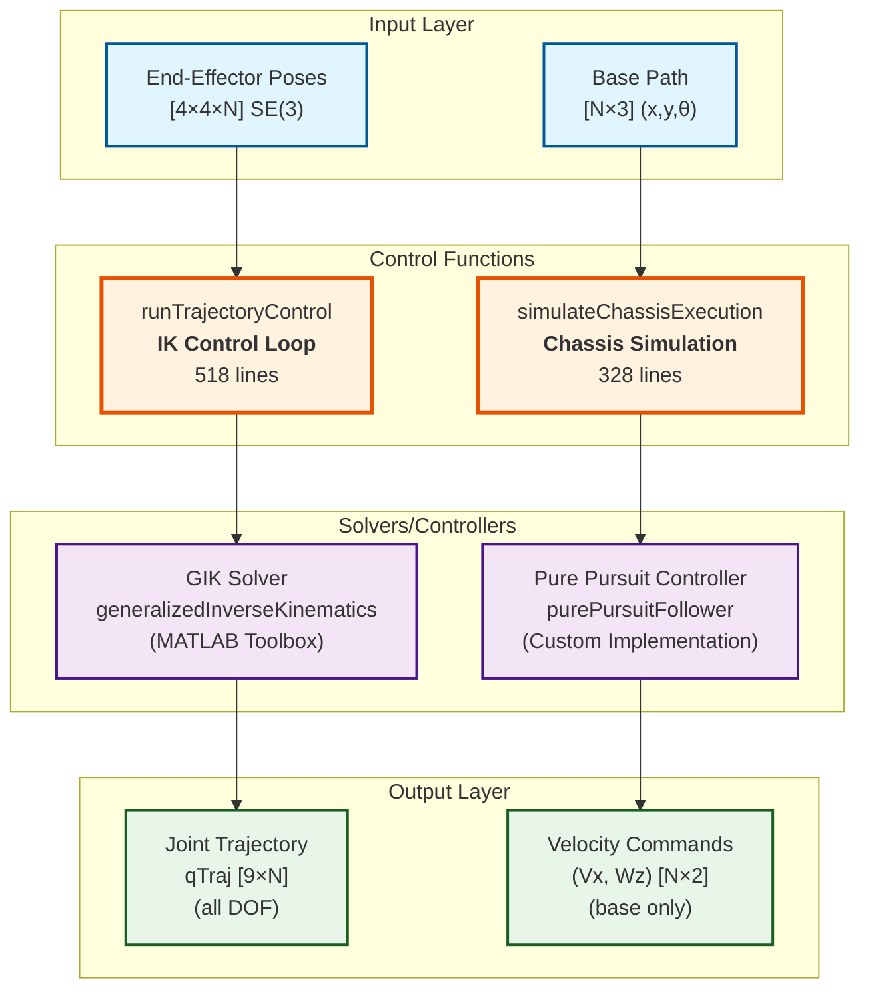

# Three-Pass Architecture: How They Work Together

```mermaid
flowchart TB
    subgraph "Pass 1: Reference IK"
        P1_INPUT["Input: EE Poses [4×4×N]"]
        P1_RTC["runTrajectoryControl<br/>(GIK solver)"]
        P1_OUTPUT["Output: qTraj [9×N]<br/><i>IDEAL trajectory</i>"]
        P1_EXTRACT["Extract base:<br/>baseRef = qTraj(1:3,:)'<br/>[N×3]"]
        
        P1_INPUT --> P1_RTC
        P1_RTC --> P1_OUTPUT
        P1_OUTPUT --> P1_EXTRACT
    end
    
    subgraph "Pass 2: Chassis Simulation"
        P2_INPUT["Input: baseRef [N×3]"]
        P2_SCC["simulateChassisExecution<br/>(Pure pursuit + dynamics)"]
        P2_OUTPUT["Output: executedBase [N×3]<br/><i>REALISTIC trajectory</i>"]
        P2_CONSTRAINTS["Applies:<br/>• vx_max = 1.5 m/s<br/>• wz_max = 2.0 rad/s<br/>• accel = 0.8 m/s²<br/>• wheel limits"]
        
        P2_INPUT --> P2_SCC
        P2_SCC --> P2_CONSTRAINTS
        P2_CONSTRAINTS --> P2_OUTPUT
    end
    
    subgraph "Pass 3: Final IK with Fixed Base"
        P3_INPUT["Input: EE Poses [4×4×N]<br/>+ executedBase [N×3]"]
        P3_RTC["runTrajectoryControl<br/>(GIK + FixedJointTrajectory)"]
        P3_OUTPUT["Output: qTraj [9×N]<br/><i>ACTUAL trajectory</i>"]
        P3_NOTE["Base locked to executedBase<br/>Arm tracks EE"]
        
        P3_INPUT --> P3_RTC
        P3_RTC --> P3_NOTE
        P3_NOTE --> P3_OUTPUT
    end
    
    P1_EXTRACT --> P2_INPUT
    P2_OUTPUT --> P3_INPUT
    
    P3_OUTPUT --> FINAL["Final Log:<br/>• qTraj [9×N]<br/>• eePositions [3×N]<br/>• purePursuit data<br/>• chassis commands"]
    
    %% Styling
    classDef pass1Style fill:#ffebee,stroke:#c62828,stroke-width:2px
    classDef pass2Style fill:#fff3e0,stroke:#ef6c00,stroke-width:2px
    classDef pass3Style fill:#e8f5e9,stroke:#2e7d32,stroke-width:2px
    classDef finalStyle fill:#e3f2fd,stroke:#1565c0,stroke-width:3px
    
    class P1_INPUT,P1_RTC,P1_OUTPUT,P1_EXTRACT pass1Style
    class P2_INPUT,P2_SCC,P2_OUTPUT,P2_CONSTRAINTS pass2Style
    class P3_INPUT,P3_RTC,P3_OUTPUT,P3_NOTE pass3Style
    class FINAL finalStyle
```

# Key Differences Summary

| Aspect | runTrajectoryControl | simulateChassisExecution |
|--------|---------------------|--------------------------|
| **Problem Type** | Inverse Kinematics | Controller Simulation |
| **Input** | EE poses (SE(3)) | Base waypoints (x,y,θ) |
| **Output** | Joint angles qTraj | Velocity commands (Vx,Wz) |
| **Solver** | generalizedInverseKinematics | Pure pursuit follower |
| **DOF** | All 9 (3 base + 6 arm) | Base only (3 DOF) |
| **Constraints** | IK constraints (pose, distance) | Chassis dynamics (velocity, accel) |
| **Integration** | None (step-by-step IK) | Yes (integrates Vx,Wz → x,y,θ) |
| **Purpose** | Find joint config for EE target | Simulate how robot follows path |
| **Used In** | Pass 1, Pass 3, Stage A, Stage B (gikInLoop) | Pass 2, Stage B (pureHyb) |

**Conclusion:** They are complementary, not duplicated! ✅
