# Staged Mode: Complete Data Flow Diagram

**Date:** October 12, 2025  
**Purpose:** Comprehensive visualization of all execution paths, options, and data transformations in staged mode

---

## Complete Data Flow with All Options

This diagram shows every execution option available in staged mode, including all branching paths and configuration choices.

```mermaid
flowchart TB
    %% Entry Point
    START(["🎯 Entry Script<br/>run_staged_reference.m"])
    
    %% Configuration Loading
    LOAD_CFG["📋 Load Configuration<br/>pipeline_profiles.yaml<br/>chassis_profiles.yaml"]
    ENV_CFG["🌍 Environment Config<br/>Base home pose<br/>Obstacles<br/>Margins"]
    
    %% Mode Router
    ROUTER["🔀 Mode Router<br/>trackReferenceTrajectory.m<br/>Mode='staged'"]
    
    %% Load Reference
    LOAD_REF["📂 Load Reference<br/>1_pull_world_scaled.json<br/>148 EE waypoints"]
    CREATE_ROBOT["🤖 Create Robot Model<br/>createRobotModel()<br/>9 DOF (3 base + 6 arm)"]
    ATTACH_OBS["🚧 Attach Obstacles<br/>Floor discs + constraints"]
    INIT_Q0["⚙️ Initialize q0<br/>Base at home pose<br/>Arm configuration"]
    
    %% Stage Orchestrator
    ORCHESTRATOR["🎭 Stage Orchestrator<br/>runStagedTrajectory.m"]
    
    %% ==================================================
    %% STAGE A: ARM RAMP-UP
    %% ==================================================
    STAGE_A["🔴 STAGE A: ARM RAMP-UP<br/>Base locked, arm aligns"]
    
    A_INPUT["📥 Input<br/>q0 (initial config)<br/>T1 (first EE pose)"]
    A_INTERP["📊 Generate Poses<br/>50 interpolated poses<br/>T0 → T1 (arm only)"]
    A_BUNDLE["🔧 Create Solver<br/>bundleA = createGikSolver()<br/>Base joints LOCKED"]
    A_CONTROL["🎮 Run Control<br/>runTrajectoryControl(bundleA)<br/>IK loop tracking"]
    A_OUTPUT["📤 Output: logA<br/>qTraj [9×NA]<br/>timestamps<br/>diagnostics"]
    A_END["✅ qA_end"]
    
    %% ==================================================
    %% STAGE B: BASE NAVIGATION
    %% ==================================================
    STAGE_B["🟡 STAGE B: BASE NAVIGATION<br/>Arm locked, base moves"]
    
    B_INPUT["📥 Input<br/>qA_end<br/>Target base pose"]
    B_MODE_DECISION{"🔀 Stage B Mode?"}
    
    %% Stage B: gikInLoop Path
    B_GIK_LABEL["Mode: gikInLoop"]
    B_GIK_INTERP["📊 Linear Interpolation<br/>50 base waypoints<br/>(x,y,θ) path"]
    B_GIK_BUNDLE["🔧 Create Solver<br/>bundleB = createGikSolver()<br/>Arm joints LOCKED"]
    B_GIK_CONTROL["🎮 Run Control<br/>runTrajectoryControl(bundleB)<br/>IK tracking base path"]
    B_GIK_OUTPUT["📤 Output: logB<br/>qTraj [9×NB]<br/>Standard IK log"]
    
    %% Stage B: pureHyb Path
    B_PURE_LABEL["Mode: pureHyb"]
    B_COMPUTE_GOAL["🎯 Compute Goal<br/>From first EE waypoint<br/>Base pose target"]
    B_HYBRID_DECISION{"Use Hybrid A*?"}
    
    B_HYBRID_YES["✅ Hybrid A* Planning"]
    B_HYBRID_PLAN["🗺️ Plan Path<br/>Hybrid A* search<br/>Resolution, primitives<br/>Turning radius"]
    B_HYBRID_PATH["📍 Hybrid A* path<br/>(x,y,θ) waypoints"]
    
    B_HYBRID_NO["❌ Linear Interpolation"]
    B_LINEAR_PATH["📍 Linear path<br/>Straight-line interpolation"]
    
    B_MERGE_PATH["📍 Base Path<br/>(x,y,θ) waypoints"]
    
    %% Stage B: Optional Smoothing
    B_RS_DECISION{"Use Reeds-Shepp<br/>Shortcuts?"}
    B_RS_YES["✅ Reeds-Shepp Smoothing"]
    B_RS_SMOOTH["🔄 RS Refinement<br/>rsRefinePath()<br/>Shortcut optimization<br/>Min turning radius"]
    B_RS_PATH["📍 RS-smoothed path"]
    
    B_RS_NO["❌ Skip RS"]
    
    B_CLOTHOID_DECISION{"Use Clothoid<br/>Refinement?"}
    B_CLOTHOID_YES["✅ Clothoid Smoothing"]
    B_CLOTHOID_SMOOTH["🔄 Clothoid Refinement<br/>rsClothoidRefine()<br/>Continuous curvature"]
    B_CLOTHOID_PATH["📍 Clothoid-smoothed path"]
    
    B_CLOTHOID_NO["❌ Skip Clothoid"]
    
    B_FINAL_PATH["📍 Final Base Path<br/>(x,y,θ) trajectory"]
    
    %% Stage B: Pure Pursuit Simulation
    B_PP_SIM["🎮 Simulate Controller<br/>simulateChassisExecution()<br/>Pure pursuit follower"]
    B_PP_EXECUTE["🚗 Execute<br/>Generate (Vx, Wz) commands<br/>Integrate to states"]
    B_PURE_OUTPUT["📤 Output: logB<br/>pathStates<br/>cmdLog<br/>executedPath<br/>Synthetic log"]
    
    B_MERGE_OUTPUT["📤 Stage B Complete"]
    B_END["✅ qB_end"]
    
    %% ==================================================
    %% STAGE C: FULL-BODY TRACKING
    %% ==================================================
    STAGE_C["🟢 STAGE C: FULL-BODY TRACKING<br/>Both base and arm track"]
    
    C_INPUT["📥 Input<br/>qB_end (after Stage B)<br/>Remaining EE waypoints"]
    C_MODE_DECISION{"🔀 Execution Mode?"}
    
    %% Stage C: pureIk Path
    C_PUREIK_LABEL["Mode: pureIk"]
    C_PUREIK_BUNDLE["🔧 Create Solver<br/>bundleC = createGikSolver()<br/>Standard GIK solver"]
    C_PUREIK_CONTROL["🎮 Run Control<br/>runTrajectoryControl(bundleC)<br/>Full-body IK tracking"]
    C_PUREIK_OUTPUT["📤 Output: logC<br/>qTraj [9×NC]<br/>Standard IK log"]
    
    %% Stage C: ppForIk Path (Three-Pass Architecture)
    C_PPFORIK_LABEL["Mode: ppForIk<br/>(Three-Pass Architecture)"]
    
    %% Pass 1: Reference IK
    C_PASS1["🔵 PASS 1: Reference IK<br/>Get ideal base trajectory"]
    C_P1_BUNDLE["🔧 Create bundleRef<br/>Standard GIK solver"]
    C_P1_CONTROL["🎮 Run Control<br/>runTrajectoryControl(bundleRef)<br/>Full-body IK"]
    C_P1_OUTPUT["📤 logRef<br/>qTraj with ideal base path"]
    C_P1_EXTRACT["📍 Extract baseReference<br/>[N×3] (x, y, θ)"]
    
    %% Optional Base Refinement
    C_REFINE_DECISION{"Use Base<br/>Refinement?"}
    C_REFINE_YES["✅ Refine Base Path"]
    C_RS_REFINE["🔄 Reeds-Shepp<br/>rsRefinePath()"]
    C_CLOTHOID_REFINE["🔄 Clothoid<br/>rsClothoidRefine()"]
    C_REFINED_PATH["📍 Refined baseReference"]
    C_REFINE_NO["❌ Use Original Path"]
    
    C_FINAL_REF["📍 Final Reference Path<br/>(x,y,θ) trajectory"]
    
    %% Pass 2: Chassis Simulation
    C_PASS2["🔵 PASS 2: Chassis Simulation<br/>Get realistic base trajectory"]
    C_P2_CONFIG["⚙️ Configure Chassis<br/>vx_max, wz_max<br/>accel_limit, track width<br/>Pure pursuit parameters"]
    C_P2_SIM["🎮 Simulate Controller<br/>simulateChassisExecution()<br/>Pure pursuit follower"]
    C_P2_PP["🚗 Pure Pursuit<br/>Generate (Vx, Wz) commands<br/>Lookahead logic"]
    C_P2_INTEGRATE["📊 Integrate Motion<br/>Dynamics model<br/>Velocity → position"]
    C_P2_OUTPUT["📤 Simulation Results<br/>executedBase [N×3]<br/>cmdLog (Vx, Wz)<br/>wheelSpeeds"]
    
    %% Pass 3: Final IK with Fixed Base
    C_PASS3["🔵 PASS 3: Final IK<br/>Lock base to realistic trajectory"]
    C_P3_BUNDLE["🔧 Create bundleFinal<br/>Standard GIK solver"]
    C_P3_FIX["🔒 FixedJointTrajectory<br/>Base joints locked to<br/>executedBase trajectory"]
    C_P3_CONTROL["🎮 Run Control<br/>runTrajectoryControl(bundleFinal)<br/>Arm tracks EE<br/>Base follows executed path"]
    C_P3_OUTPUT["📤 Output: logC<br/>qTraj [9×NC]<br/>purePursuit data<br/>Full diagnostics"]
    
    C_MERGE_OUTPUT["📤 Stage C Complete"]
    
    %% ==================================================
    %% LOG MERGING AND SAVING
    %% ==================================================
    MERGE["🔗 Merge Stage Logs<br/>mergeStageLogs()"]
    MERGE_QTRAJ["📊 Concatenate qTraj<br/>All stages combined"]
    MERGE_TIME["⏱️ Concatenate timestamps<br/>Continuous time"]
    MERGE_STRUCT["📦 Create Pipeline Struct<br/>log (combined)<br/>stageLogs.stageA<br/>stageLogs.stageB<br/>stageLogs.stageC"]
    SAVE["💾 Save Results<br/>results/<timestamp>/<br/>log_staged_*.mat"]
    
    %% ==================================================
    %% OPTIONAL ANIMATION
    %% ==================================================
    ANIM_DECISION{"Generate<br/>Animation?"}
    ANIM_YES["✅ Create Animation"]
    ANIM_LOAD["📂 Load log_staged_*.mat"]
    ANIM_RENDER["🎬 Render Animation<br/>viz.animate_whole_body()<br/>Forward kinematics<br/>Stage boundaries<br/>Overlays"]
    ANIM_SAVE["💾 Save Animation<br/>*.mp4 video file"]
    ANIM_NO["❌ Skip Animation"]
    
    END_COMPLETE["🏁 PIPELINE COMPLETE"]
    
    %% ==================================================
    %% CONNECTIONS
    %% ==================================================
    
    %% Entry and Setup
    START --> LOAD_CFG
    LOAD_CFG --> ENV_CFG
    ENV_CFG --> ROUTER
    ROUTER --> LOAD_REF
    LOAD_REF --> CREATE_ROBOT
    CREATE_ROBOT --> ATTACH_OBS
    ATTACH_OBS --> INIT_Q0
    INIT_Q0 --> ORCHESTRATOR
    
    %% Stage A Flow
    ORCHESTRATOR --> STAGE_A
    STAGE_A --> A_INPUT
    A_INPUT --> A_INTERP
    A_INTERP --> A_BUNDLE
    A_BUNDLE --> A_CONTROL
    A_CONTROL --> A_OUTPUT
    A_OUTPUT --> A_END
    
    %% Stage B Flow
    A_END --> STAGE_B
    STAGE_B --> B_INPUT
    B_INPUT --> B_MODE_DECISION
    
    %% Stage B: gikInLoop Branch
    B_MODE_DECISION -->|gikInLoop| B_GIK_LABEL
    B_GIK_LABEL --> B_GIK_INTERP
    B_GIK_INTERP --> B_GIK_BUNDLE
    B_GIK_BUNDLE --> B_GIK_CONTROL
    B_GIK_CONTROL --> B_GIK_OUTPUT
    B_GIK_OUTPUT --> B_MERGE_OUTPUT
    
    %% Stage B: pureHyb Branch
    B_MODE_DECISION -->|pureHyb| B_PURE_LABEL
    B_PURE_LABEL --> B_COMPUTE_GOAL
    B_COMPUTE_GOAL --> B_HYBRID_DECISION
    
    B_HYBRID_DECISION -->|UseStageBHybridAStar=true| B_HYBRID_YES
    B_HYBRID_YES --> B_HYBRID_PLAN
    B_HYBRID_PLAN --> B_HYBRID_PATH
    B_HYBRID_PATH --> B_MERGE_PATH
    
    B_HYBRID_DECISION -->|UseStageBHybridAStar=false| B_HYBRID_NO
    B_HYBRID_NO --> B_LINEAR_PATH
    B_LINEAR_PATH --> B_MERGE_PATH
    
    %% Stage B: Optional Smoothing
    B_MERGE_PATH --> B_RS_DECISION
    B_RS_DECISION -->|StageBUseReedsShepp=true| B_RS_YES
    B_RS_YES --> B_RS_SMOOTH
    B_RS_SMOOTH --> B_RS_PATH
    B_RS_PATH --> B_CLOTHOID_DECISION
    
    B_RS_DECISION -->|StageBUseReedsShepp=false| B_RS_NO
    B_RS_NO --> B_CLOTHOID_DECISION
    
    B_CLOTHOID_DECISION -->|StageBUseClothoid=true| B_CLOTHOID_YES
    B_CLOTHOID_YES --> B_CLOTHOID_SMOOTH
    B_CLOTHOID_SMOOTH --> B_CLOTHOID_PATH
    B_CLOTHOID_PATH --> B_FINAL_PATH
    
    B_CLOTHOID_DECISION -->|StageBUseClothoid=false| B_CLOTHOID_NO
    B_CLOTHOID_NO --> B_FINAL_PATH
    
    %% Stage B: Pure Pursuit Execution
    B_FINAL_PATH --> B_PP_SIM
    B_PP_SIM --> B_PP_EXECUTE
    B_PP_EXECUTE --> B_PURE_OUTPUT
    B_PURE_OUTPUT --> B_MERGE_OUTPUT
    
    B_MERGE_OUTPUT --> B_END
    
    %% Stage C Flow
    B_END --> STAGE_C
    STAGE_C --> C_INPUT
    C_INPUT --> C_MODE_DECISION
    
    %% Stage C: pureIk Branch
    C_MODE_DECISION -->|pureIk| C_PUREIK_LABEL
    C_PUREIK_LABEL --> C_PUREIK_BUNDLE
    C_PUREIK_BUNDLE --> C_PUREIK_CONTROL
    C_PUREIK_CONTROL --> C_PUREIK_OUTPUT
    C_PUREIK_OUTPUT --> C_MERGE_OUTPUT
    
    %% Stage C: ppForIk Branch (Three-Pass)
    C_MODE_DECISION -->|ppForIk| C_PPFORIK_LABEL
    
    %% Pass 1
    C_PPFORIK_LABEL --> C_PASS1
    C_PASS1 --> C_P1_BUNDLE
    C_P1_BUNDLE --> C_P1_CONTROL
    C_P1_CONTROL --> C_P1_OUTPUT
    C_P1_OUTPUT --> C_P1_EXTRACT
    
    %% Optional Refinement
    C_P1_EXTRACT --> C_REFINE_DECISION
    C_REFINE_DECISION -->|StageCUseBaseRefinement=true| C_REFINE_YES
    C_REFINE_YES --> C_RS_REFINE
    C_RS_REFINE --> C_CLOTHOID_REFINE
    C_CLOTHOID_REFINE --> C_REFINED_PATH
    C_REFINED_PATH --> C_FINAL_REF
    
    C_REFINE_DECISION -->|StageCUseBaseRefinement=false| C_REFINE_NO
    C_REFINE_NO --> C_FINAL_REF
    
    %% Pass 2
    C_FINAL_REF --> C_PASS2
    C_PASS2 --> C_P2_CONFIG
    C_P2_CONFIG --> C_P2_SIM
    C_P2_SIM --> C_P2_PP
    C_P2_PP --> C_P2_INTEGRATE
    C_P2_INTEGRATE --> C_P2_OUTPUT
    
    %% Pass 3
    C_P2_OUTPUT --> C_PASS3
    C_PASS3 --> C_P3_BUNDLE
    C_P3_BUNDLE --> C_P3_FIX
    C_P3_FIX --> C_P3_CONTROL
    C_P3_CONTROL --> C_P3_OUTPUT
    C_P3_OUTPUT --> C_MERGE_OUTPUT
    
    %% Merging and Saving
    C_MERGE_OUTPUT --> MERGE
    MERGE --> MERGE_QTRAJ
    MERGE_QTRAJ --> MERGE_TIME
    MERGE_TIME --> MERGE_STRUCT
    MERGE_STRUCT --> SAVE
    
    %% Optional Animation
    SAVE --> ANIM_DECISION
    ANIM_DECISION -->|Optional| ANIM_YES
    ANIM_YES --> ANIM_LOAD
    ANIM_LOAD --> ANIM_RENDER
    ANIM_RENDER --> ANIM_SAVE
    ANIM_SAVE --> END_COMPLETE
    
    ANIM_DECISION -->|Skip| ANIM_NO
    ANIM_NO --> END_COMPLETE
    
    %% Styling
    classDef stageA fill:#ffcccc,stroke:#cc0000,stroke-width:3px
    classDef stageB fill:#ffffcc,stroke:#cccc00,stroke-width:3px
    classDef stageC fill:#ccffcc,stroke:#00cc00,stroke-width:3px
    classDef decision fill:#e1d5e7,stroke:#9673a6,stroke-width:2px
    classDef output fill:#dae8fc,stroke:#6c8ebf,stroke-width:2px
    classDef process fill:#fff2cc,stroke:#d6b656,stroke-width:2px
    
    class STAGE_A,A_INPUT,A_INTERP,A_BUNDLE,A_CONTROL,A_OUTPUT,A_END stageA
    class STAGE_B,B_INPUT,B_GIK_LABEL,B_GIK_INTERP,B_GIK_BUNDLE,B_GIK_CONTROL,B_GIK_OUTPUT,B_PURE_LABEL,B_COMPUTE_GOAL,B_HYBRID_YES,B_HYBRID_PLAN,B_HYBRID_PATH,B_HYBRID_NO,B_LINEAR_PATH,B_MERGE_PATH,B_RS_YES,B_RS_SMOOTH,B_RS_PATH,B_RS_NO,B_CLOTHOID_YES,B_CLOTHOID_SMOOTH,B_CLOTHOID_PATH,B_CLOTHOID_NO,B_FINAL_PATH,B_PP_SIM,B_PP_EXECUTE,B_PURE_OUTPUT,B_MERGE_OUTPUT,B_END stageB
    class STAGE_C,C_INPUT,C_PUREIK_LABEL,C_PUREIK_BUNDLE,C_PUREIK_CONTROL,C_PUREIK_OUTPUT,C_PPFORIK_LABEL,C_PASS1,C_P1_BUNDLE,C_P1_CONTROL,C_P1_OUTPUT,C_P1_EXTRACT,C_REFINE_YES,C_RS_REFINE,C_CLOTHOID_REFINE,C_REFINED_PATH,C_REFINE_NO,C_FINAL_REF,C_PASS2,C_P2_CONFIG,C_P2_SIM,C_P2_PP,C_P2_INTEGRATE,C_P2_OUTPUT,C_PASS3,C_P3_BUNDLE,C_P3_FIX,C_P3_CONTROL,C_P3_OUTPUT,C_MERGE_OUTPUT stageC
    class B_MODE_DECISION,B_HYBRID_DECISION,B_RS_DECISION,B_CLOTHOID_DECISION,C_MODE_DECISION,C_REFINE_DECISION,ANIM_DECISION decision
    class A_OUTPUT,B_GIK_OUTPUT,B_PURE_OUTPUT,B_MERGE_OUTPUT,C_PUREIK_OUTPUT,C_P1_OUTPUT,C_P2_OUTPUT,C_P3_OUTPUT,C_MERGE_OUTPUT,SAVE,ANIM_SAVE output
```



---

## Configuration Options Summary

### Stage B Options

| Option | Values | Description |
|--------|--------|-------------|
| **StageBMode** | `"gikInLoop"` \| `"pureHyb"` | Base navigation method |
| **UseStageBHybridAStar** | `true` \| `false` | Use Hybrid A* planning (pureHyb only) |
| **StageBUseReedsShepp** | `true` \| `false` | Apply RS shortcut optimization |
| **StageBUseClothoid** | `true` \| `false` | Apply clothoid smoothing |
| **StageBChassisControllerMode** | `-1` \| `0` \| `1` \| `2` | Controller type (-1=auto, 0=diff, 1=ackermann, 2=pure pursuit) |
| **StageBMaxLinearSpeed** | `double` | Max forward velocity (m/s) |
| **StageBMaxYawRate** | `double` | Max angular velocity (rad/s) |
| **StageBLookaheadDistance** | `double` | Pure pursuit lookahead (m) |

### Stage C Options

| Option | Values | Description |
|--------|--------|-------------|
| **ExecutionMode** | `"pureIk"` \| `"ppForIk"` | Full-body tracking method |
| **StageCUseBaseRefinement** | `true` \| `false` | Refine base path in ppForIk mode |
| **StageCChassisControllerMode** | `-1` \| `0` \| `1` \| `2` | Controller type |
| **StageCMaxLinearSpeed** | `double` | Max forward velocity (m/s) |
| **StageCMaxAngularVelocity** | `double` | Max angular velocity (rad/s) |
| **StageCLookaheadDistance** | `double` | Pure pursuit lookahead (m) |
| **StageCLookaheadVelGain** | `double` | Velocity-dependent lookahead gain |
| **StageCTrackWidth** | `double` | Wheel track width (m) - **0.574 m** |
| **StageCWheelBase** | `double` | Wheelbase length (m) |

---

## Execution Mode Combinations

### Common Configurations

| Configuration | Stage B Mode | Stage C Mode | Description |
|---------------|--------------|--------------|-------------|
| **Full Pure Pursuit** | `pureHyb` | `ppForIk` | Maximum realism, simulated controllers throughout |
| **Hybrid Realistic** | `pureHyb` | `pureIk` | Realistic base docking, IK-driven tracking |
| **GIK with Realistic Tracking** | `gikInLoop` | `ppForIk` | IK-driven docking, realistic tracking |
| **Full GIK (Legacy)** | `gikInLoop` | `pureIk` | Pure IK throughout (fastest, least realistic) |

### Recommended Settings

**Default Profile** (`pipeline_profiles.yaml`):
```yaml
profiles:
  default:
    stage_b:
      mode: pureHyb
      use_hybrid_astar: false
      use_reeds_shepp: true
      use_clothoid: true
      max_linear_speed: 1.5
      lookahead_distance: 0.6
      controller_mode: 2  # Pure pursuit
      
    stage_c:
      execution_mode: ppForIk
      use_base_refinement: false
      max_linear_speed: 1.5
      max_angular_velocity: 2.0
      lookahead_distance: 0.8
      lookahead_vel_gain: 0.2
      controller_mode: 2  # Pure pursuit
      
    chassis:
      track: 0.574  # Critical: must match robot
      accel_limit: 0.8
      vx_max: 1.5
      wz_max: 2.0
```

---

## Data Structures

### Pipeline Output Structure

```matlab
pipeline = struct(
    'log',              % Combined log (all stages)
    'stageLogs',        % Per-stage logs
    'stageInfo',        % Stage metadata
    'configUsed'        % Configuration snapshot
);
```

### Stage Logs Structure

```matlab
stageLogs = struct(
    'stageA', struct(
        'qTraj',           % [9×NA] joint trajectory
        'timestamps',      % [1×NA] time stamps
        'eePositions',     % [3×NA] actual EE positions
        'targetPositions', % [3×NA] desired EE positions
        'successMask'      % [1×NA] solver success
    ),
    
    'stageB', struct(
        'qTraj',           % [9×NB] joint trajectory
        'timestamps',      % [1×NB] time stamps
        'mode',            % 'gikInLoop' or 'pureHyb'
        'pathStates',      % [NB×3] base path (pureHyb)
        'cmdLog',          % [NB×2] (Vx,Wz) commands
        'diagnostics'      % Planning/smoothing info
    ),
    
    'stageC', struct(
        'qTraj',           % [9×NC] joint trajectory
        'timestamps',      % [1×NC] time stamps
        'eePositions',     % [3×NC] actual EE positions
        'targetPositions', % [3×NC] desired EE positions
        'mode',            % 'pureIk' or 'ppForIk'
        'purePursuit',     % Pure pursuit data (ppForIk)
        '  .referencePath',     % [N×3] reference base
        '  .executedPath',      % [N×3] executed base
        '  .commands',          % [N×2] (Vx, Wz)
        '  .wheelSpeeds',       % [N×2] left/right wheels
        'successMask'      % [1×NC] solver success
    )
);
```

### Pure Pursuit Data Structure

```matlab
purePursuit = struct(
    'referencePath',       % [N×3] (x, y, θ) ideal
    'executedPath',        % [N×3] (x, y, θ) realistic
    'commands',            % [N×2] (Vx, Wz)
    'wheelSpeeds',         % [N×2] (ωL, ωR) rad/s
    'lookAheadPoints',     % [N×3] target points
    'pathErrors',          % [N×1] lateral errors
    'status',              % Controller status codes
    'simulation',          % Full simulation struct
    'configUsed'           % Chassis parameters
);
```

---

## Key Files Reference

| File | Purpose | Stage |
|------|---------|-------|
| `runStagedTrajectory.m` | Main orchestrator | All |
| `executeStageBPureHyb.m` | pureHyb navigation | B |
| `executeStageBGikInLoop.m` | gikInLoop navigation | B |
| `executeStageCPurePursuit.m` | ppForIk tracking | C |
| `executeStageCPureIk.m` | pureIk tracking | C |
| `simulateChassisExecution.m` | Chassis simulation | B, C |
| `unifiedChassisCtrl.m` | Controller logic | B, C |
| `rsRefinePath.m` | Reeds-Shepp smoothing | B, C |
| `rsClothoidRefine.m` | Clothoid smoothing | B, C |
| `mergeStageLogs.m` | Log concatenation | Final |

---

## Algorithm Equivalence

**Critical Note:** Holistic `ppForIk` and Stage C `ppForIk` use **IDENTICAL** three-pass architecture:

1. **Pass 1:** Reference IK → ideal base trajectory
2. **Pass 2:** `simulateChassisExecution()` → realistic executed trajectory
3. **Pass 3:** Final IK with `FixedJointTrajectory` → arm tracks EE with realistic base

See `HOLISTIC_STAGEC_EQUIVALENCE.md` for detailed analysis.

---

## See Also

- **Project Overview:** `PROJECT_OVERVIEW.md`
- **Algorithm Equivalence:** `HOLISTIC_STAGEC_EQUIVALENCE.md`
- **Unified Config:** `UNIFIED_CONFIG_MIGRATION_COMPLETE.md`
- **Detailed Analysis:** `projectDiagnosis.md`
- **Code:** `matlab/+gik9dof/runStagedTrajectory.m`
